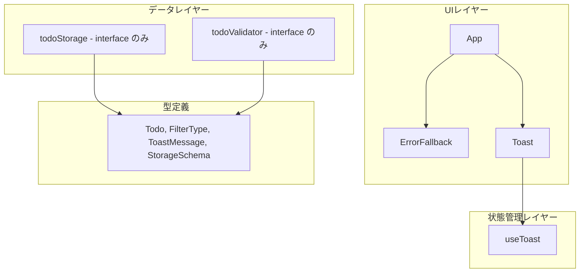
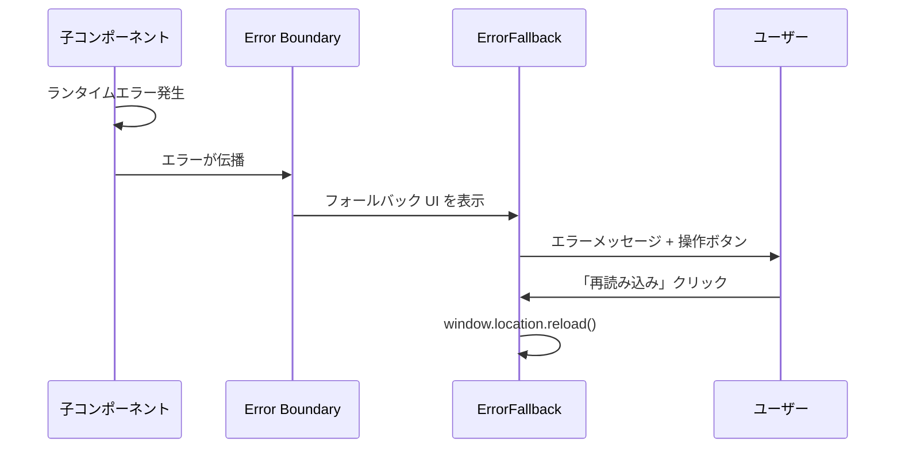
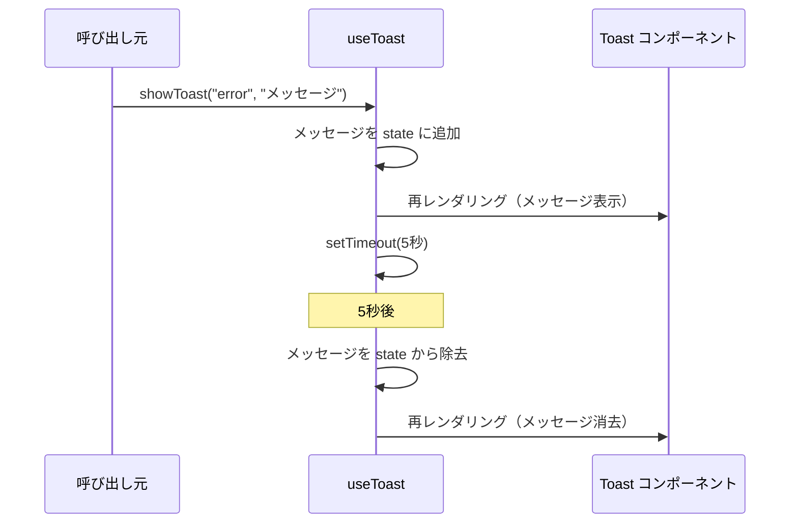

# 設計書

## アーキテクチャ概要

`docs/architecture.md` のレイヤードアーキテクチャをそのまま採用。scaffolding ではレイヤーの骨格を作り、各レイヤーに最低限のファイルを配置する。

## コンポーネント設計

### 1. App

**責務**:

- アプリケーション全体のレイアウト（ヘッダー + メインエリア）
- Error Boundary の設置
- Toast の表示領域の管理

**実装の要点**:

- react-error-boundary ライブラリは使わず、クラスコンポーネントで Error Boundary を実装（外部依存を最小化）
- Error Boundary は `src/app.tsx` 内にプライベートコンポーネントとして定義
- レイアウトは Tailwind CSS の `max-w-lg mx-auto` でセンタリング

**ファイル配置**:

- `src/app.tsx`

### 2. ErrorFallback

**責務**:

- 予期しないエラー発生時のフォールバック UI 表示
- 「再読み込み」ボタン（`window.location.reload()`）
- 「データをリセット」ボタン（確認ダイアログ → localStorage クリア + リロード）

**実装の要点**:

- エラーメッセージは日本語で表示:「問題が発生しました」「予期しないエラーが発生しました。ページを再読み込みしてください。」
- 「データをリセット」クリック時に `window.confirm()` で確認ダイアログを表示。キャンセルで操作を中止
- ボタンの優先順位: 「再読み込み」がプライマリ（塗りつぶし青）、「データをリセット」がセカンダリ（赤アウトライン）
- Error Boundary の `onReset` コールバック経由で処理を受け取る（再利用性確保）
- エラーの技術的詳細は表示しない。開発環境でのみ `error.message` をコンソールに出力
- Tailwind CSS でシンプルなエラー画面をスタイリング

**ファイル配置**:

- `src/components/error-fallback/error-fallback.tsx`
- `src/components/error-fallback/error-fallback.test.tsx`
- `src/components/error-fallback/index.ts`

### 3. Toast

**責務**:

- ToastMessage の一覧をスタック表示
- error（赤）/ warning（黄）/ info（青）の視覚的区別
- 手動消去ボタン
- warning / info に自動消去プログレスバー表示

**実装の要点**:

- `role="alert"` でスクリーンリーダー対応
- `aria-live` は種別で動的に切り替え: error → `"assertive"`、warning / info → `"polite"`
- 位置は画面右上に固定（`fixed top-4 right-4`）
- アニメーションは CSS transition で fade-in/fade-out
- プログレスバー: Toast 下部に細いバー、CSS transition で幅 100% → 0% にアニメーション

**ファイル配置**:

- `src/components/toast/toast.tsx`
- `src/components/toast/toast.test.tsx`
- `src/components/toast/index.ts`

### 4. useToast

**責務**:

- ToastMessage の状態管理（追加・自動消去・手動消去）
- 5 秒後の自動消去タイマー管理

**実装の要点**:

- 自動消去の種別制御: error は手動消去のみ、warning は 10 秒、info は 5 秒
- `setTimeout` で自動消去。コンポーネントのアンマウント時にタイマーをクリア
- メッセージ ID は `crypto.randomUUID()` で生成
- 最大表示数は 5 件（error はカウント対象外。超過分は古いものから自動消去）

**ファイル配置**:

- `src/hooks/use-toast.ts`
- `src/hooks/use-toast.test.ts`

### 5. 型定義

**責務**:

- `docs/functional-design.md` のデータモデルを TypeScript 型として定義

**実装の要点**:

- 全フィールドに `readonly` を付与
- `FilterType` はユニオンリテラル型

**ファイル配置**:

- `src/types/todo.ts`

### 6. todoStorage（interface のみ）

**責務**:

- localStorage への読み書きの interface 定義
- 定数定義（STORAGE_KEY, SCHEMA_VERSION）

**実装の要点**:

- 具体的な実装は次のフェーズ（Todo CRUD）で行う
- interface と定数のみをエクスポート

**ファイル配置**:

- `src/lib/storage/todo-storage.ts`
- `src/lib/storage/index.ts`

### 7. todoValidator（interface のみ）

**責務**:

- Todo データのバリデーション関数の型定義

**実装の要点**:

- 具体的な実装は次のフェーズで行う

**ファイル配置**:

- `src/lib/validators/todo-validator.ts`
- `src/lib/validators/index.ts`

## データフロー

### Error Boundary のエラーキャッチ

### Toast 通知フロー

## テスト方針

### ユニットテスト

- **ErrorFallback**: ボタンクリック時の動作（reload, localStorage クリア）
- **Toast**: メッセージの表示・消去、aria 属性の存在
- **useToast**: showToast / dismissToast の動作、自動消去タイマー
- **型定義**: 型のみなのでテスト不要

### 統合テスト

- App + Error Boundary: エラー発生時に ErrorFallback が表示される

### E2E テスト（smoke test）

- 開発サーバーにアクセスし、App コンポーネントが表示されることを確認（1 件のみ）

## セキュリティ考慮事項

- CSP ヘッダーを `index.html` の meta タグに設定
- `dangerouslySetInnerHTML` の使用禁止（Biome ルールで検出）

## パフォーマンス考慮事項

- 初期バンドルサイズを最小化（scaffolding 段階では React + Tailwind のみ）
- Vite の Tree Shaking を活用

## アクセシビリティ考慮事項

- Toast: `role="alert"`, `aria-live="polite"`
- ErrorFallback: セマンティック HTML（`<main>`, `<h1>`, `
`, `<button>`）
- ボタン: フォーカス可能、`focus-visible` リングを表示

## 将来の拡張性

- Error Boundary はアプリ全体をラップしており、どのコンポーネントのエラーもキャッチ可能
- useToast は任意のコンポーネントから呼び出し可能で、Todo CRUD のエラー通知にそのまま使える
- todoStorage / todoValidator は interface のみ定義し、次フェーズで実装を差し込む

## 参照ドキュメント

- `docs/architecture.md` - アーキテクチャ設計書
- `docs/project-structure.md` - プロジェクト構造定義書
- `docs/development-guidelines.md` - 開発ガイドライン
