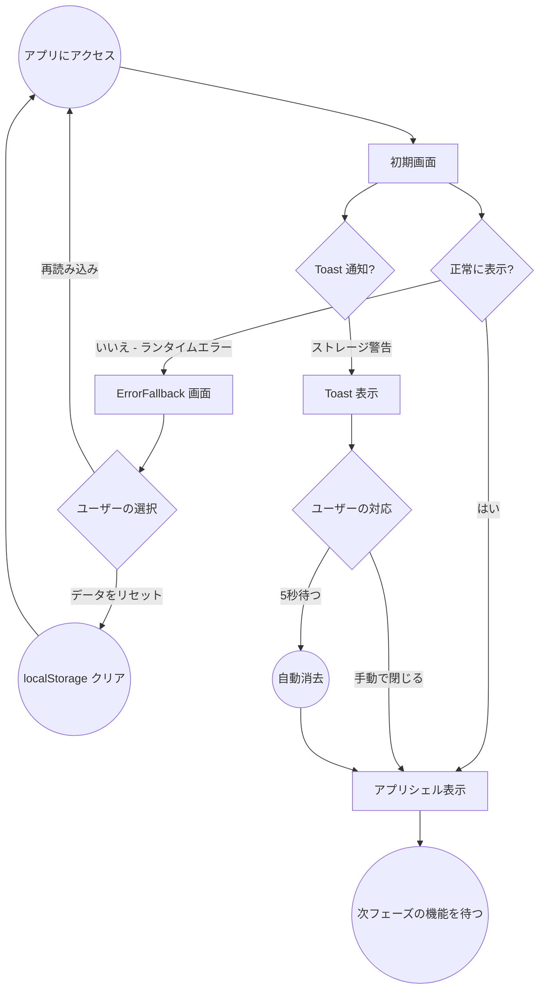

# ユーザーフロー: Scaffolding

## メインフロー

scaffolding フェーズでは機能的なユーザーフローは限定的。
初回アクセス時の表示と、エラー発生時の復旧フローを定義する。

## 画面一覧

| # | 画面名 | 説明 | 状態 |
|---|--------|------|------|
| 1 | 初期画面（アプリシェル） | ヘッダー + 空のメインエリア | 正常時 |
| 2 | ErrorFallback | エラーメッセージ + 復旧ボタン | エラー時 |
| 3 | Toast 通知 | 画面右上のスタック通知 | 警告/エラー発生時 |

## 凡例

- 円: ユーザーアクション
- 矩形: 画面/UI 状態
- 菱形: 意思決定ポイント
