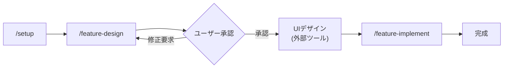
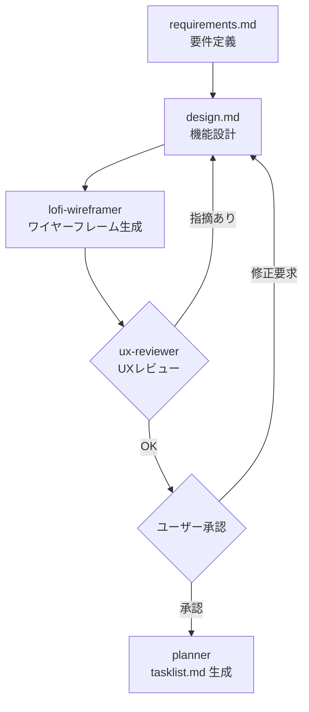
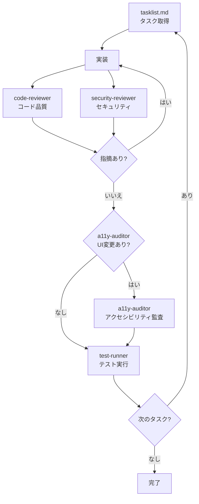
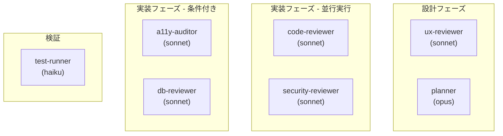
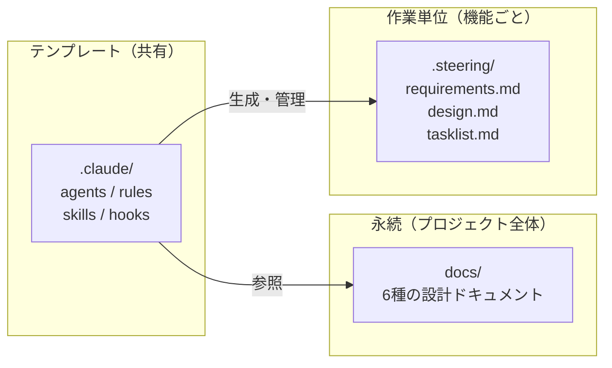
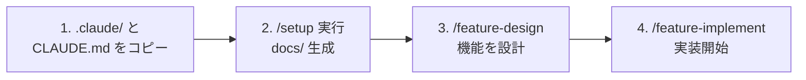

# DECK : Claude Code Development Template

Claude Code の開発ワークフローをテンプレート化したもの。設計と実装を分離し、AI の出力に人間の承認を挟む **Human-in-the-Loop** のアプローチを取る。

## 全体ワークフロー



| 規模 | コマンド / 作業 | プロセス | 成果物 |
|:---|:---|:---|:---|
| 基盤構築 | `/setup` | 対話的に永続ドキュメント生成 | `docs/` 6種 |
| 機能開発 | `/feature-design` → `/feature-implement` | steering 一式、全レビュー、承認フロー | `.steering/[日付]-feature-*/` |
| UIデザイン | Pencil (推奨) / Figma 等 | 外部ツールで作成 | `docs/designs/` |
| パッチ | `/patch [説明]` | changeset.md + レビュー + テスト | `.steering/[日付]-patch-*/` |
| ホットフィックス | `/hotfix [説明]` | changeset.md + レビュー + テスト | `.steering/[日付]-hotfix-*/` |

## 設計フェーズの詳細

`/feature-design` は要件定義から設計、レビュー、タスク分解までを一気通貫で行う。



## 実装フェーズの詳細

`/feature-implement` は tasklist.md に従って実装し、エージェントが自動でレビューする。



> code-reviewer と security-reviewer は並行実行される。

## エージェント



| Agent | Model | 自動起動条件 |
|:---|:---|:---|
| planner | opus | `/feature-design` 内部で tasklist.md 生成時 |
| ux-reviewer | sonnet | design.md 作成直後 |
| code-reviewer | sonnet | コード変更直後 |
| security-reviewer | sonnet | コード変更直後（code-reviewer と並行） |
| a11y-auditor | sonnet | UI コンポーネント実装直後 |
| db-reviewer | sonnet | DB スキーマ変更直後 |
| test-runner | haiku | フェーズ完了時 |

エージェントはプロジェクト固有の記述を持たず、`docs/` や `package.json` から動的に検出する。

## ディレクトリ構造

```
.claude/
  agents/          専門家エージェント定義（Task ツールで起動）
  rules/common/    汎用ルール（自動読み込み）
  hooks/           ツール実行後の自動処理
  skills/          スキル（スラッシュコマンド + テンプレート + ガイド）
  settings.json    権限・フック設定
docs/              永続ドキュメント（/setup で生成）
  designs/         デザインファイル（.pen 等、機能横断で共有）
  proposals/       下書き・アイデア・技術調査メモ
.steering/         作業単位のドキュメント（feature / patch / hotfix）
```



## ルール

`.claude/rules/common/` に配置。Claude Code が自動的に読み込む。

| ファイル | 内容 |
|:---|:---|
| `workflow.md` | Do's/Don'ts、成果物レビュー、承認フロー |
| `coding-style.md` | 命名規則、型安全、関数設計、Biome 必須 |
| `testing.md` | TDD、カバレッジ 80%+、AAA パターン |
| `git-workflow.md` | Conventional Commits、PR プロセス |
| `security.md` | OWASP Top 10、入力バリデーション |
| `agents.md` | エージェント委譲、並行実行パターン |

## スキル

`.claude/skills/` に定義。`/スキル名` で実行するワークフロースキルと、他のスキルから呼び出されるサブスキルがある。

### ワークフロースキル（`/スキル名` で実行）

| スキル | 用途 |
|:---|:---|
| `/setup` | 初回セットアップ（docs/ に 6 ファイル生成） |
| `/setup-infra` | インフラ構成・CI/CD パイプライン構築 |
| `/feature-design` | 機能設計（.steering/ 生成 + UX レビュー） |
| `/feature-implement` | 承認済み設計に基づく実装開始 |
| `/patch` | 小規模なバグ修正・改善（軽量プロセス） |
| `/hotfix` | 緊急の軽微な修正（最小プロセス） |
| `/checkpoint` | 作業状態の記録 |
| `/review-code` | code-reviewer + security-reviewer 並行実行 |
| `/run-tests` | test-runner 起動 |
| `/audit-a11y` | a11y-auditor 起動 |
| `/review-docs` | ドキュメントレビュー |
| `/pre-deploy` | デプロイ前ゲートチェック |

### サブスキル（テンプレート同梱）

| スキル | 用途 |
|:---|:---|
| steering | 作業計画・tasklist.md 管理 |
| prd-architect | プロダクト要求定義書の作成 |
| functional-design | 機能設計書の作成 |
| architecture-design | アーキテクチャ設計書の作成 |
| project-structure | プロジェクト構造定義の作成 |
| development-guidelines | 開発ガイドラインの作成 |
| glossary-creation | 用語集の作成 |
| lofi-wireframer | ワイヤーフレーム生成 |
| infra-guide | インフラ構成設計ガイド |
| ci-cd | CI/CD ワークフロー生成 |

### プロジェクト追加（例）

| スキル | 技術スタック |
|:---|:---|
| db-migration | Drizzle ORM / Supabase |
| component-builder | shadcn/ui / React |
| api-route-builder | Next.js Route Handler |

プロジェクトの技術スタックに合わせて追加・差し替えする。

## フック

`.claude/hooks/` に定義。ツール実行のライフサイクルイベントで自動実行される。

| フック | トリガー | 処理 |
|:---|:---|:---|
| `auto-format.sh` | Edit / Write 後 | Biome で自動フォーマット |

## 使い方

### 新規プロジェクトへの適用



1. `.claude/` ディレクトリと `CLAUDE.md` をプロジェクトルートにコピー
2. プロジェクト追加スキルを技術スタックに合わせて調整
3. `/setup` を実行して `docs/` の永続ドキュメントを対話的に作成
   - `docs/product-requirements.md` - プロダクト要求定義書
   - `docs/functional-design.md` - 機能設計書
   - `docs/architecture.md` - アーキテクチャ設計書
   - `docs/project-structure.md` - プロジェクト構造定義
   - `docs/development-guidelines.md` - 開発ガイドライン
   - `docs/glossary.md` - 用語集
4. `/feature-design [機能名]` で設計を開始

### 前提条件

- jq（フック内で JSON パースに使用）

ランタイム・パッケージマネージャ・Linter 等は `/setup` 時に `docs/development-guidelines.md` で定義する。

## ライセンス

MIT
