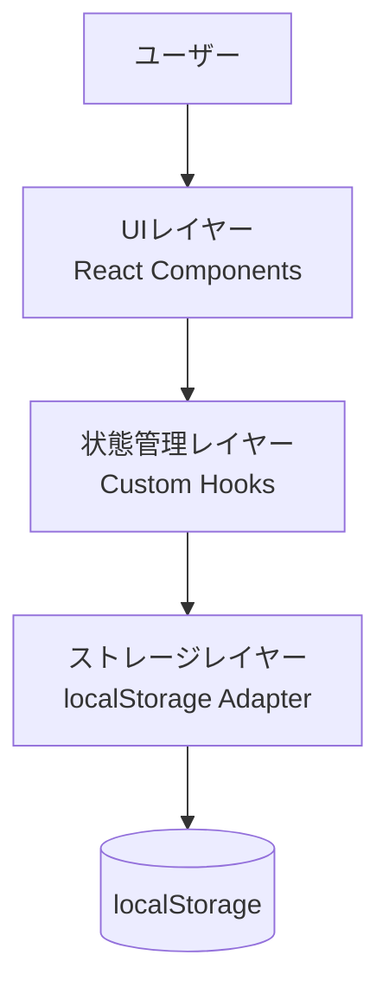
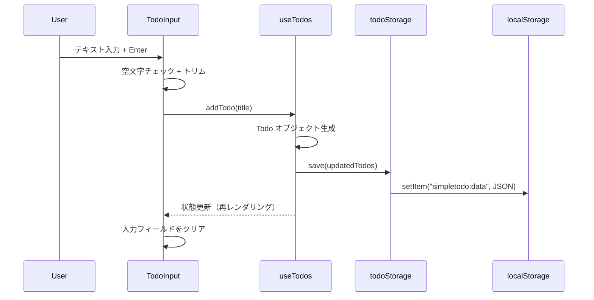
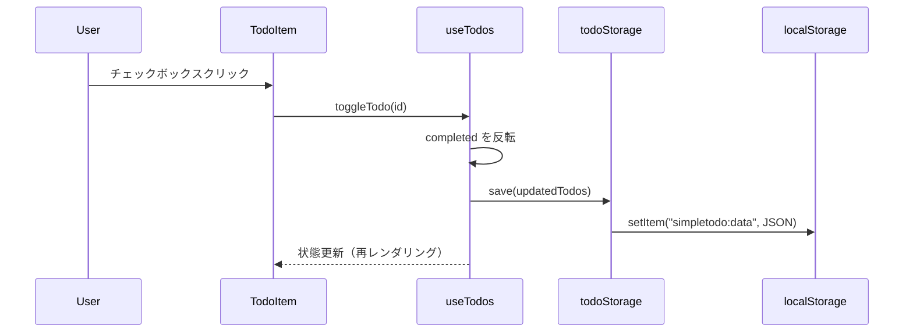
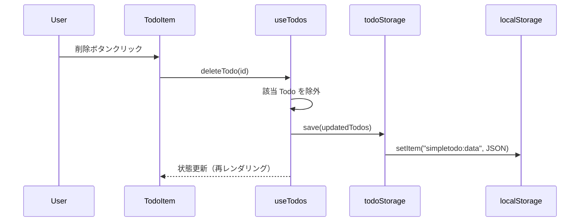
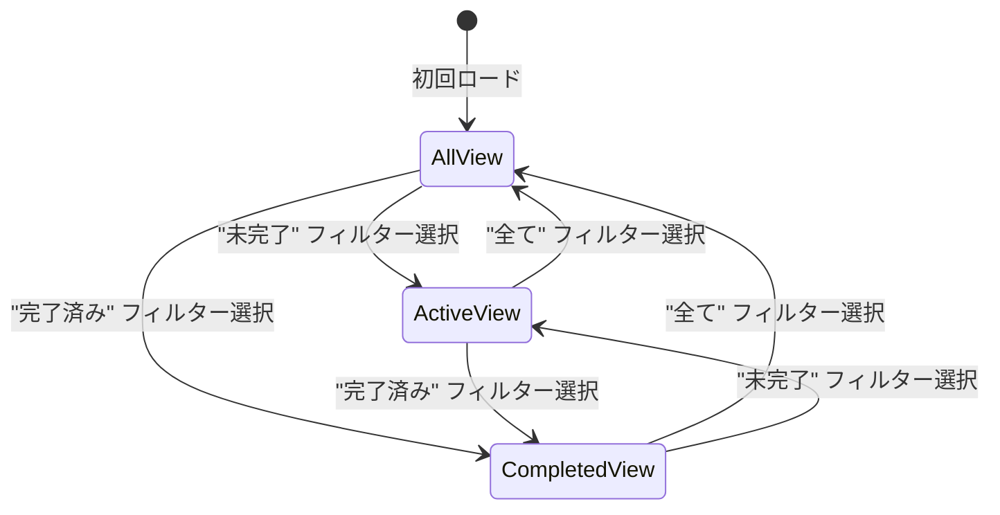
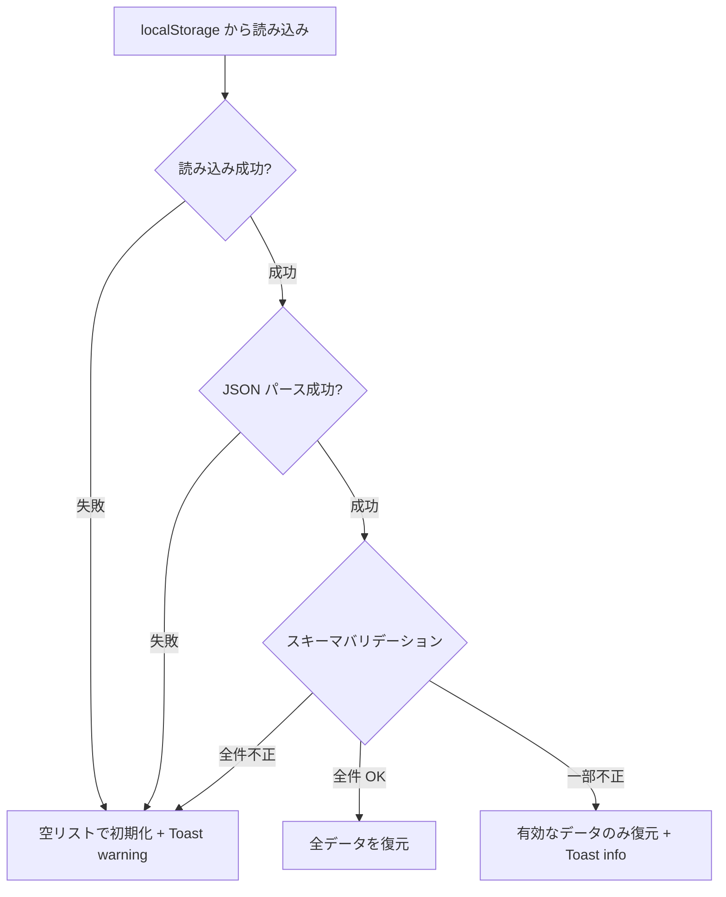

# 機能設計書 (Functional Design Document)

## システム構成図



クライアントサイド完結の SPA アーキテクチャ。サーバーサイドは存在しない。

## 技術スタック

| 分類 | 技術 | 選定理由 |
|------|------|----------|
| 言語 | TypeScript 5.x | 型安全性による品質向上、IDE サポート |
| UI ライブラリ | React 19 | コンポーネントベース設計、エコシステムの充実 |
| ビルドツール | Vite 6 | 高速な HMR、軽量なバンドル出力 |
| CSS | Tailwind CSS 4 | ユーティリティファースト、レスポンシブ対応が容易 |
| テスト | Vitest + Testing Library | Vite との統合、DOM テストの自然な記述 |
| Lint/Format | Biome | 高速な Lint + Format 統合ツール |

## データモデル定義

### エンティティ: Todo

```typescript
type Todo = {
  readonly id: string;          // crypto.randomUUID() で生成
  readonly title: string;       // タスクのテキスト（1-200文字）
  readonly completed: boolean;  // 完了状態
  readonly createdAt: string;   // ISO 8601 形式の作成日時
};
```

**制約**:
- `id`: UUID v4 形式、一意
- `title`: 1 文字以上 200 文字以下、前後の空白はトリム
- `completed`: デフォルト `false`
- `createdAt`: `new Date().toISOString()` で生成、変更不可

### ストレージスキーマ

```typescript
type StorageSchema = {
  readonly todos: ReadonlyArray<Todo>;
  readonly version: number;  // スキーマバージョン（将来のマイグレーション用）
};
```

localStorage キー: `simpletodo:data`

## コンポーネント設計

### UIレイヤー

#### App

**責務**:
- アプリケーション全体のレイアウト
- 子コンポーネントの配置

#### TodoInput

**責務**:
- テキスト入力の受け付け
- Enter キー / ボタンクリックでタスク追加をトリガー
- 空文字バリデーション

**Props**:
```typescript
type TodoInputProps = {
  readonly onAdd: (title: string) => void;
};
```

#### TodoList

**責務**:
- フィルタリング済みタスク一覧の表示
- 各タスクの完了トグル・削除のデリゲート

**Props**:
```typescript
type TodoListProps = {
  readonly todos: ReadonlyArray<Todo>;
  readonly onToggle: (id: string) => void;
  readonly onDelete: (id: string) => void;
};
```

#### TodoItem

**責務**:
- 単一タスクの表示（チェックボックス、タイトル、削除ボタン）
- 完了済みの視覚的区別（取り消し線、透明度低下）

**Props**:
```typescript
type TodoItemProps = {
  readonly todo: Todo;
  readonly onToggle: (id: string) => void;
  readonly onDelete: (id: string) => void;
};
```

#### TodoFilter

**責務**:
- フィルター状態の切り替え UI
- 未完了タスク件数の表示

**Props**:
```typescript
type FilterType = "all" | "active" | "completed";

type TodoFilterProps = {
  readonly current: FilterType;
  readonly onChange: (filter: FilterType) => void;
  readonly activeCount: number;
};
```

#### ErrorFallback

**責務**:
- Error Boundary のフォールバック UI 表示
- 再読み込みとデータリセットの操作提供

**Props**:
```typescript
type ErrorFallbackProps = {
  readonly error: Error;
  readonly onReset: () => void;
};
```

### 状態管理レイヤー

#### useTodos（カスタムフック）

**責務**:
- Todo の CRUD 操作
- フィルタリングロジック
- ストレージとの同期
- 操作エラーの通知（useToast 経由）

**インターフェース**:
```typescript
type UseTodosReturn = {
  readonly todos: ReadonlyArray<Todo>;
  readonly filteredTodos: ReadonlyArray<Todo>;
  readonly filter: FilterType;
  readonly activeCount: number;
  readonly addTodo: (title: string) => void;
  readonly toggleTodo: (id: string) => void;
  readonly deleteTodo: (id: string) => void;
  readonly setFilter: (filter: FilterType) => void;
};
```

**依存関係**:
- `todoStorage`（ストレージレイヤー）
- `useToast`（通知フック）

### ストレージレイヤー

#### todoStorage

**責務**:
- localStorage への読み書き
- データのバリデーションとフォールバック
- JSON シリアライゼーション

**インターフェース**:
```typescript
type TodoStorage = {
  readonly load: () => ReadonlyArray<Todo>;
  readonly save: (todos: ReadonlyArray<Todo>) => void;
};
```

## ユースケース図

### タスク追加



**フロー説明**:
1. ユーザーがテキストを入力し Enter キーまたは追加ボタンを押す
2. TodoInput が空文字チェックとトリムを行い、有効なら addTodo を呼ぶ
3. useTodos が新しい Todo を生成し、状態を更新
4. todoStorage 経由で localStorage に永続化
5. 状態更新により再レンダリングが発生し、タスク一覧に反映

### タスク完了トグル



### タスク削除



## 画面遷移図



単一画面アプリのため、画面遷移はフィルター状態の切り替えのみ。ルーティングは不要。

## UI設計

### レイアウト構造

```
+------------------------------------------+
|              SimpleTodo                    |
+------------------------------------------+
| [ タスクを入力...          ] [追加]        |
+------------------------------------------+
| [ ] タスク1                          [x]  |
| [v] タスク2 (取り消し線)             [x]  |
| [ ] タスク3                          [x]  |
+------------------------------------------+
| [全て] [未完了] [完了済み]   残り: 2件    |
+------------------------------------------+
```

### カラーコーディング

- 未完了タスク: テキスト色 `text-gray-900`（通常表示）
- 完了済みタスク: テキスト色 `text-gray-400` + 取り消し線
- フィルターボタン（選択中）: `bg-blue-600 text-white`
- フィルターボタン（非選択）: `bg-gray-100 text-gray-700`
- 削除ボタン: `text-gray-400 hover:text-red-500`

### レスポンシブ対応

- モバイル（< 640px）: フルワイド、パディング縮小
- デスクトップ（>= 640px）: 最大幅 `max-w-lg` でセンタリング

## パフォーマンス最適化

- **React.memo**: TodoItem を memo 化し、不要な再レンダリングを防止
- **useMemo**: filteredTodos をメモ化し、フィルター変更時のみ再計算
- **バンドルサイズ**: Vite の Tree Shaking で未使用コードを除去

## セキュリティ考慮事項

- **XSS 対策**: React の JSX エスケープ機構により、ユーザー入力は自動的にサニタイズされる。`dangerouslySetInnerHTML` は使用しない
- **localStorage バリデーション**: 読み込み時に JSON パースとスキーマバリデーションを行い、不正データはフォールバック（空配列）で処理

## エラーハンドリング

### 通知コンポーネント

エラーや警告をユーザーに伝えるための Toast 通知コンポーネントを設ける。

#### Toast

**責務**:
- エラー・警告・情報メッセージの一時的な表示
- 一定時間後に自動消去（5 秒）
- 複数メッセージのスタック表示

**Props**:
```typescript
type ToastType = "error" | "warning" | "info";

type ToastMessage = {
  readonly id: string;
  readonly type: ToastType;
  readonly message: string;
};

type ToastProps = {
  readonly messages: ReadonlyArray<ToastMessage>;
  readonly onDismiss: (id: string) => void;
};
```

#### useToast（カスタムフック）

```typescript
type UseToastReturn = {
  readonly messages: ReadonlyArray<ToastMessage>;
  readonly showToast: (type: ToastType, message: string) => void;
  readonly dismissToast: (id: string) => void;
};
```

### エラーの分類と処理方針

**原則**: ユーザーのデータに影響するエラーは必ず通知する。表示上の軽微な問題のみサイレント処理。

#### 入力バリデーションエラー

| エラー種別 | 処理 | ユーザーへの表示 |
|-----------|------|-----------------|
| 空文字入力 | 追加処理をスキップ | 入力フィールドにフォーカスを戻す（暗黙的） |
| 200文字超過 | 追加処理をスキップ | Toast(warning): 「タスクは200文字以内で入力してください」 |

#### ストレージエラー

| エラー種別 | 処理 | ユーザーへの表示 |
|-----------|------|-----------------|
| localStorage 利用不可 | メモリ内のみで動作 | Toast(warning): 「ブラウザのストレージが利用できません。データはページを閉じると失われます」 |
| localStorage 読み込みエラー | 空のリストで初期化 | Toast(warning): 「保存データの読み込みに失敗しました。新しいリストで開始します」 |
| JSON パースエラー | 空のリストで初期化 | Toast(warning): 「保存データが破損していました。新しいリストで開始します」 |
| スキーマ不一致 | バリデーション通過分のみ復元 | Toast(info): 「一部のデータを復元できませんでした（N件中M件を復元）」 |
| localStorage 書き込みエラー | メモリ内で動作継続 | Toast(error): 「データの保存に失敗しました。ブラウザのストレージ容量を確認してください」 |
| localStorage 容量超過 (QuotaExceededError) | メモリ内で動作継続 | Toast(error): 「ストレージの容量が不足しています。完了済みタスクを削除してください」 |

#### ランタイムエラー

| エラー種別 | 処理 | ユーザーへの表示 |
|-----------|------|-----------------|
| 存在しない Todo ID の操作 | 操作をスキップ | Toast(error): 「対象のタスクが見つかりませんでした」 |
| 予期しないエラー | Error Boundary でキャッチ | フォールバック UI:「問題が発生しました。ページを再読み込みしてください」+ 再読み込みボタン |

### Error Boundary

React の Error Boundary を App のトップレベルに設置し、未捕捉エラーによるクラッシュを防止する。

```typescript
type ErrorFallbackProps = {
  readonly error: Error;
  readonly onReset: () => void;
};
```

**フォールバック UI の要件**:
- エラーメッセージ（技術的詳細は非表示）
- 「再読み込み」ボタン（`window.location.reload()`）
- 「データをリセット」ボタン（localStorage をクリアして再読み込み）

### ストレージ読み込みのバリデーションフロー



## テスト戦略

### ユニットテスト

- `todoStorage`: load/save の動作、不正データのフォールバック、容量超過エラー
- `todoStorage`: スキーマバリデーション（不正な型、欠損フィールド、部分復元）
- `useTodos`: addTodo, toggleTodo, deleteTodo, フィルタリング
- `useTodos`: 存在しない ID への操作時のエラー通知
- `useToast`: メッセージ追加、自動消去、手動消去
- バリデーション: 空文字、200 文字超、トリム処理

### 統合テスト

- TodoInput → useTodos → todoStorage の追加フロー
- TodoItem → useTodos → todoStorage のトグル/削除フロー
- フィルター切り替え → 表示タスクの更新
- ストレージエラー → Toast 通知の表示確認
- localStorage 利用不可 → 警告表示 + メモリ内動作

### E2Eテスト

- タスクの追加 → 完了 → 削除の一連フロー
- ページリロード後のデータ永続化確認
- フィルター切り替えの動作確認
- Error Boundary: 予期しないエラー時のフォールバック UI 表示と復帰操作
