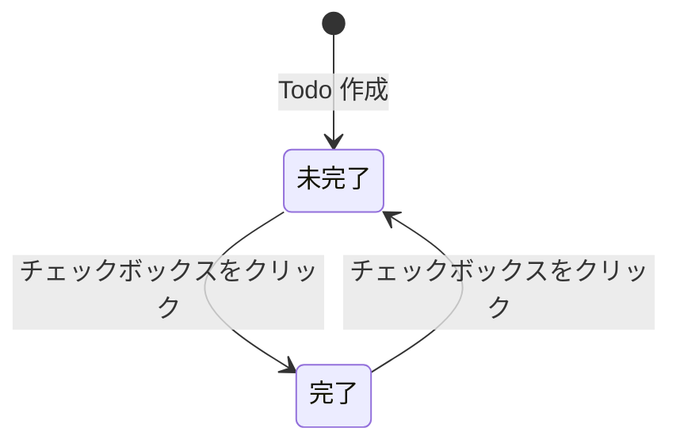

# プロジェクト用語集 (Glossary)

## 概要

SimpleTodo プロジェクトで使用される用語の定義を管理する。

**更新日**: 2026-02-16

## ドメイン用語

### Todo

**定義**: ユーザーが完了すべき作業の単位。タイトルと完了状態を持つ。

**説明**: SimpleTodo におけるコアエンティティ。追加・完了トグル・削除の 3 操作が可能。カテゴリや優先度は持たない（スコープ外）。

**関連用語**: [フィルター](#フィルター)

**使用例**:
- 「Todo を追加する」: 新しいタスクをリストに登録する
- 「Todo を完了にする」: チェックボックスで completed を true にする

**英語表記**: Todo

**データモデル**: `src/types/todo.ts`

### フィルター

**定義**: Todo 一覧の表示を完了状態に基づいて絞り込む機能。

**説明**: 3 つのフィルター値（`all`, `active`, `completed`）でタスク一覧の表示を切り替える。フィルターはメモリ内の状態のみで、localStorage には保存しない。

**関連用語**: [Todo](#todo)

**使用例**:
- 「未完了フィルターに切り替える」: `active` を選択し、未完了 Todo のみ表示する

**英語表記**: Filter

**型定義**: `src/types/todo.ts` の `FilterType`

### Toast

**定義**: エラー・警告・情報をユーザーに一時的に通知する UI コンポーネント。

**説明**: 画面端に表示され、5 秒後に自動消去される。複数メッセージをスタック表示可能。`error`, `warning`, `info` の 3 種類。

**関連用語**: [Error Boundary](#error-boundary)

**使用例**:
- 「Toast でストレージエラーを通知する」: localStorage 書き込み失敗時に Toast(error) を表示する

**英語表記**: Toast

## 技術用語

### React

**定義**: Meta 社が開発した UI ライブラリ。コンポーネントベースの宣言的 UI 構築を提供する。

**本プロジェクトでの用途**: 全 UI コンポーネントの構築。関数コンポーネント + Hooks パターンで使用。

**バージョン**: 19.x

**関連ドキュメント**: [アーキテクチャ設計書](./architecture.md#テクノロジースタック)

### Vite

**定義**: ESM ベースの高速ビルドツール・開発サーバー。

**本プロジェクトでの用途**: 開発サーバー（HMR）、本番ビルド（バンドル + Tree Shaking）。

**バージョン**: 6.x

**設定ファイル**: `vite.config.ts`

### Tailwind CSS

**定義**: ユーティリティファーストの CSS フレームワーク。

**本プロジェクトでの用途**: 全スタイリング。レスポンシブデザインのブレークポイント管理。カスタム CSS は原則禁止。

**バージョン**: 4.x

**関連ドキュメント**: [開発ガイドライン](./development-guidelines.md#tailwind-css-の使用規約)

### Biome

**定義**: Rust 製の高速 Lint + Format 統合ツール。ESLint + Prettier の代替。

**本プロジェクトでの用途**: コードの静的解析とフォーマット。

**バージョン**: 2.x

**設定ファイル**: `biome.json`

### Vitest

**定義**: Vite ベースのテストフレームワーク。Jest 互換 API を提供。

**本プロジェクトでの用途**: ユニットテスト、統合テスト。Testing Library と組み合わせて使用。

**バージョン**: 3.x

### Playwright

**定義**: Microsoft 社が開発したクロスブラウザ E2E テストフレームワーク。

**本プロジェクトでの用途**: E2E テスト。localStorage を含むブラウザ API のテスト。

**バージョン**: 1.x

**設定ファイル**: `playwright.config.ts`

## 略語・頭字語

### SPA

**正式名称**: Single Page Application

**意味**: 単一の HTML ページで動作し、ページ遷移なしにコンテンツを動的に更新する Web アプリケーション。

**本プロジェクトでの使用**: SimpleTodo はクライアントサイド完結の SPA として構築。サーバーサイドレンダリングは使用しない。

### WCAG

**正式名称**: Web Content Accessibility Guidelines

**意味**: W3C が策定した Web コンテンツのアクセシビリティガイドライン。

**本プロジェクトでの使用**: WCAG 2.1 AA 準拠を目標とする。カラーコントラスト 4.5:1 以上、キーボード操作対応、スクリーンリーダー対応。

### CSP

**正式名称**: Content Security Policy

**意味**: Web ブラウザのセキュリティ機構。許可されたリソースの読み込み元を制限する。

**本プロジェクトでの使用**: `index.html` の meta タグで設定。`default-src 'self'` をベースに、Tailwind CSS のために `style-src 'unsafe-inline'` を許可。

### HMR

**正式名称**: Hot Module Replacement

**意味**: アプリケーション実行中にモジュールを差し替える仕組み。ページ全体のリロードなしにコード変更を反映する。

**本プロジェクトでの使用**: Vite の開発サーバーが提供。React コンポーネントの変更が即座にブラウザに反映される。

### LCP

**正式名称**: Largest Contentful Paint

**意味**: Web Vitals の指標の一つ。ページ内の最大コンテンツ要素が表示されるまでの時間。

**本プロジェクトでの使用**: 目標 1 秒以内。Lighthouse で測定。

## アーキテクチャ用語

### レイヤードアーキテクチャ

**定義**: システムを役割ごとに複数の層に分割し、上位層から下位層への一方向の依存関係を持たせる設計パターン。

**本プロジェクトでの適用**:

```
UI レイヤー (components/)
    ↓
状態管理レイヤー (hooks/)
    ↓
データレイヤー (lib/)
```

**関連コンポーネント**: 全ソースコードディレクトリ

**関連ドキュメント**: [アーキテクチャ設計書](./architecture.md#アーキテクチャパターン)、[プロジェクト構造](./project-structure.md#モジュール境界と依存関係ルール)

### コロケーション

**定義**: 関連するファイル（実装とテスト等）を同じディレクトリに配置するパターン。

**本プロジェクトでの適用**: ユニットテストはソースファイルと同階層に配置する（例: `todo-item.tsx` と `todo-item.test.tsx`）。

**関連ドキュメント**: [プロジェクト構造](./project-structure.md#テストファイル配置)

### Error Boundary

**定義**: React のエラーハンドリング機構。子コンポーネントツリー内で発生した JavaScript エラーをキャッチし、フォールバック UI を表示する。

**本プロジェクトでの適用**: App のトップレベルに設置。予期しないエラー時に ErrorFallback コンポーネントを表示し、再読み込みとデータリセットの操作を提供する。

**関連用語**: [Toast](#toast)

## ステータス・状態

### Todo 完了状態

**定義**: Todo の進行状態を示す boolean 値。

| 状態 | 意味 | 遷移条件 | 次の状態 |
|------|------|---------|---------|
| `false`（未完了） | タスクが未処理 | Todo 作成時の初期状態 | `true` |
| `true`（完了） | タスクが処理済み | チェックボックスをクリック | `false` |

**状態遷移図**:


### フィルター状態

**定義**: Todo 一覧の表示フィルターの種類。

| 値 | 意味 | 表示される Todo |
|----|------|----------------|
| `all` | 全て | 全 Todo |
| `active` | 未完了 | `completed === false` の Todo |
| `completed` | 完了済み | `completed === true` の Todo |

初期値は `all`。

## データモデル用語

### Todo エンティティ

**定義**: タスクを表すデータオブジェクト。

**主要フィールド**:
- `id`: UUID v4 形式の一意識別子
- `title`: タスクのテキスト（1-200 文字）
- `completed`: 完了状態（boolean）
- `createdAt`: ISO 8601 形式の作成日時

**制約**: id は一意、title は 1-200 文字、completed のデフォルトは false

**実装**: `src/types/todo.ts`

### StorageSchema

**定義**: localStorage に保存されるデータの構造定義。

**主要フィールド**:
- `todos`: Todo の配列
- `version`: スキーママイグレーション用のバージョン番号

**localStorage キー**: `simpletodo:data`

**実装**: `src/types/todo.ts`

## 索引

### あ行
- [Error Boundary](#error-boundary) - アーキテクチャ用語

### か行
- [コロケーション](#コロケーション) - アーキテクチャ用語

### た行
- [Toast](#toast) - ドメイン用語
- [Todo](#todo) - ドメイン用語
- [Todo エンティティ](#todo-エンティティ) - データモデル用語
- [Todo 完了状態](#todo-完了状態) - ステータス

### は行
- [フィルター](#フィルター) - ドメイン用語
- [フィルター状態](#フィルター状態) - ステータス

### ら行
- [レイヤードアーキテクチャ](#レイヤードアーキテクチャ) - アーキテクチャ用語

### A-Z
- [Biome](#biome) - 技術用語
- [CSP](#csp) - 略語
- [HMR](#hmr) - 略語
- [LCP](#lcp) - 略語
- [Playwright](#playwright) - 技術用語
- [React](#react) - 技術用語
- [SPA](#spa) - 略語
- [StorageSchema](#storageschema) - データモデル用語
- [Tailwind CSS](#tailwind-css) - 技術用語
- [Vite](#vite) - 技術用語
- [Vitest](#vitest) - 技術用語
- [WCAG](#wcag) - 略語
