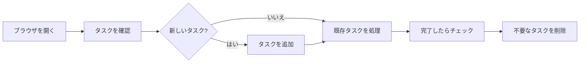

# プロダクト要求定義書 (Product Requirements Document)

## プロダクト概要

### 名称

**SimpleTodo** - やることだけに集中する Todo アプリ

### プロダクトコンセプト

- **ゼロ設定**: アカウント登録不要、開いてすぐ使える
- **高速操作**: すべての操作が 100ms 以内に完了
- **ミニマル UI**: タスクの追加・完了・削除に必要な要素のみ

### プロダクトビジョン

日常の「やること管理」に特化した、余計な機能を持たない軽量 Todo アプリ。多機能なプロジェクト管理ツールではなく、メモ帳のような手軽さでタスクを管理できる。ブラウザを開くだけで即座に使い始められ、データはローカルに保持される。

### 目的

- 日常のタスクを最小限の操作で管理できるようにする
- アカウント登録やセットアップなしで即座に利用開始できる
- レスポンシブ対応でデスクトップ・モバイルの両方で快適に使える

## ターゲットユーザー

### プライマリーペルソナ: 田中（28歳、Web エンジニア）

- 日常業務で 5-10 個のタスクを並行管理している
- 既存のプロジェクト管理ツール（Jira, Notion）は仕事用で、個人タスクには使いたくない
- 現在の課題: 付箋やメモ帳でタスク管理しているが、完了状態の追跡が困難
- 期待する解決策: ブラウザタブを開くだけで使える、シンプルなタスクリスト

## 成功指標(KPI)

### プライマリーKPI

- タスク完了率: 70% 以上（作成されたタスクのうち完了されたものの割合、リリース後 1 ヶ月）
- 操作レスポンス: 全操作が 100ms 以内（Lighthouse Performance スコア 90 以上）

### セカンダリーKPI

- Lighthouse Accessibility スコア: 95 以上（リリース時）
- 初回ロード時間: 1 秒以内（3G 回線を除くネットワーク環境）

## 機能要件

### コア機能(MVP)

#### タスク追加

**ユーザーストーリー**:
ユーザーとして、思いついたタスクをすぐに記録するために、テキスト入力でタスクを追加したい

**受け入れ条件**:

- [ ] テキストフィールドに入力し、Enter キーまたは追加ボタンでタスクを作成できる
- [ ] 空文字のタスクは作成できない（バリデーション）
- [ ] 追加後、テキストフィールドがクリアされ、即座に入力可能な状態に戻る
- [ ] 追加されたタスクはタスク一覧の末尾に表示される

**優先度**: P0(必須)

#### タスク完了トグル

**ユーザーストーリー**:
ユーザーとして、タスクの進捗を把握するために、完了状態をワンクリックで切り替えたい

**受け入れ条件**:

- [ ] タスク左のチェックボックスをクリックすると完了/未完了がトグルする
- [ ] 完了済みタスクは取り消し線と薄い色で視覚的に区別される
- [ ] 完了状態の変更は即座に永続化される

**優先度**: P0(必須)

#### タスク削除

**ユーザーストーリー**:
ユーザーとして、不要になったタスクを整理するために、タスクを削除したい

**受け入れ条件**:

- [ ] タスク右の削除ボタンをクリックするとタスクが削除される
- [ ] 削除は即座に実行される（確認ダイアログなし、軽量操作を優先）
- [ ] 削除後、タスク一覧が即座に更新される

**優先度**: P0(必須)

#### フィルタリング

**ユーザーストーリー**:
ユーザーとして、未完了タスクに集中するために、表示するタスクをフィルタリングしたい

**受け入れ条件**:

- [ ] 「全て」「未完了」「完了済み」の 3 つのフィルターボタンが表示される
- [ ] 選択中のフィルターが視覚的にハイライトされる
- [ ] フィルター変更時、タスク一覧が即座に更新される
- [ ] 未完了タスクの件数がフッターまたはフィルター付近に表示される

**優先度**: P0(必須)

#### データ永続化

**ユーザーストーリー**:
ユーザーとして、ブラウザを閉じてもタスクを失わないために、データが自動保存されてほしい

**受け入れ条件**:

- [ ] タスクの追加・完了・削除が即座に localStorage に保存される
- [ ] ページリロード後、保存されたタスクが復元される
- [ ] localStorage が利用不可の場合、メモリ内で動作し、警告メッセージを表示する

**優先度**: P0(必須)

### 将来的な機能(Post-MVP)

#### ドラッグ&ドロップ並べ替え

タスクの順序をドラッグ&ドロップで変更できる。

**優先度**: P2(できれば)

#### タスクの編集

既存タスクのテキストをインライン編集できる。

**優先度**: P2(できれば)

## 非機能要件

### パフォーマンス

- 初回ロード: 1 秒以内（キャッシュなし、高速回線環境）
- 全操作のレスポンス: 100ms 以内
- タスク一覧表示: 100 件まで描画遅延なし

### ユーザビリティ

- 新規ユーザーが説明なしで 30 秒以内に最初のタスクを追加できる
- モバイル（375px 幅）からデスクトップ（1920px 幅）まで快適に操作可能

### 信頼性

- localStorage 破損時: アプリが正常に起動し、空のタスクリストから再開できる
- 不正なデータ: JSON パースエラー時にフォールバック動作する

### セキュリティ

- XSS 対策: ユーザー入力は必ずサニタイズして表示する
- localStorage のデータは信頼せず、読み込み時にバリデーションする

### アクセシビリティ

- WCAG 2.1 AA 準拠
- キーボード操作: Tab キーで全要素にアクセス可能
- スクリーンリーダー: 適切な aria 属性とセマンティック HTML
- カラーコントラスト: 4.5:1 以上（通常テキスト）

## スコープ外

明示的にスコープ外とする項目:

- ユーザー認証・アカウント管理
- サーバーサイドのデータ保存・同期
- 複数デバイス間のデータ共有
- タスクのカテゴリ・タグ・優先度設定
- 期限・リマインダー機能
- 共有・コラボレーション機能
